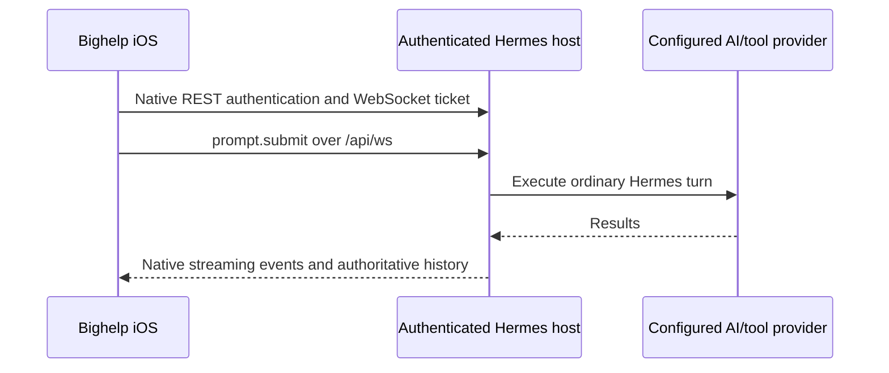
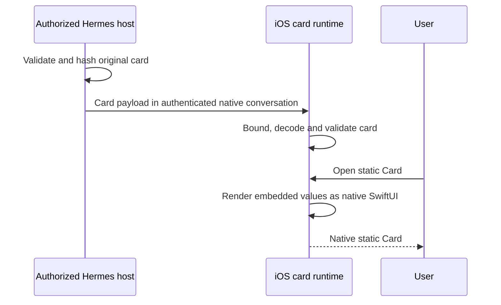

# bighelp architecture

Production transport contract: **native Hermes only for chat**. Cloud services
are used only for optional notifications and Live Activities, which BuzzKit delivers. The current composition,
voice boundary, enrollment isolation and verification requirements are defined
in [Native transport](NATIVE_TRANSPORT.md). Historical Link/paired-Direct protocol
names remain in shared value types and migration boundaries. Their names do not
imply a selectable chat transport; the disabled iOS transport graph is removed.

This document describes the current iOS codebase and its end-to-end interaction
with an authorized Hermes host and bighelp's notification services. This document
follows the implementation rather than older design proposals.

The [iPhone device-tools contract](IPHONE_DEVICE_TOOLS.md) describes the native
HealthKit and EventKit service, host-scoped permissions, authenticated Hermes tool
context, and negotiated directed Link frames.

## 1. System boundaries

Native workspaces connect directly to an independently authenticated Hermes
host through its public interfaces. A bighelp account, Link pairing and the
notification relay are not required for that connection. The optional
Link and notification paths have their own authorization and trust boundaries.

bighelp has five important trust boundaries:

1. **The iOS app** owns the user interface, local cache, device credentials,
   content encryption, notification decryption, and ActivityKit presentation.
2. **The optional bighelp account service** owns passkey account and device
   management. Retained pairing and notification cryptography do not provide
   a production chat route or select the native host.
3. **The authorized Hermes host** authenticates native workspace access and
   owns agent execution and session state. Native host authority is independent
   of optional cloud account credentials and account deletion.
4. **The notification relay** manages APNs delivery material and sends encrypted
   alert envelopes or bounded Live Activity state.
5. **External AI and tool providers** may receive plaintext needed to perform a
   request. The Hermes host selects and controls these providers.

The native workspace uses the following path:

### Implementation map

Start at the owner of a behavior, then follow its typed boundary:

| Change | Start here | Boundary to preserve |
|---|---|---|
| App construction and account separation | `Bighelp/App/BighelpAppComposition.swift` | Native host authority is independent of the optional account. |
| Chat presentation and actions | `Bighelp/Chat/ChatView.swift`, `ChatModel.swift`, `ChatComposer.swift` | The retained model owns drafts and submissions; the native timeline owns scrolling. |
| Rail, goal, tasks and subagent sheets | `Bighelp/Chat/SessionStatusRailView.swift`, `SessionGoalSheet.swift`, `SessionTasksSheet.swift`, `SessionSubagentRosterSheet.swift` | Presentation does not invent execution or session authority. |
| Local appearance | `Bighelp/DesignSystem/BighelpThemeReader.swift` | Resolve the consuming view's traits, including sheet and hosted-row overrides. |
| Shared Swift wire values | Domain-named `*WireModels.swift` files in `Bighelp/Link/`; `SharedWireValidation.swift` | A historical Link name does not select a transport. Distinct field and byte policies remain distinct. |
| Plugin HTTP mechanics | `bighelp-plugin/loopdy_plugin/http_contracts.py` | Route families keep their own errors, caps, authentication and context rechecks. |
| Python wire contracts | `bighelp-plugin/loopdy_plugin/link_contracts.py` and its explicit domain imports | The facade preserves imports; domain modules validate values without owning transport state. |
| Plugin adapter lifecycle | `bighelp-plugin/loopdy_plugin/adapter.py` and `adapter_*.py` | One adapter owns state and lifecycle. Helpers operate on that instance, not parallel controllers. |

The plugin adapter's operation modules separate delivery, presentation, sessions,
pickers, requests, transport and voice. They do not add listeners or a fallback
chat route. Native default construction remains separate from explicitly injected
compatibility transports. The HTTP helper similarly shares byte and JSON
mechanics, not authorization decisions or a generic endpoint dispatcher.

## 2. Apple-platform target structure

The XcodeGen manifest defines these application products:

- **bighelp**: the iOS, iPadOS and visionOS SwiftUI application. On Vision Pro it runs natively and adds the
  agent-in-the-room volume (`Bighelp/Spatial/`). On the Mac it runs through Mac Catalyst ("Optimize for Mac", scheme `BighelpCatalyst`)
  with a sidebar, shipped as a Developer ID DMG rather than through App Store Connect.
- **BighelpMac**: a fixture-only native macOS prototype with a dedicated app entry point and
  adaptive desktop shell. It is not the shipping Mac app.
- **BighelpWatch**: the watchOS companion application.
- **CarPlay**: a voice scene inside the iOS app (`Bighelp/CarPlay/`), not a separate product.
- **Notification service extension**: decrypts and validates alert content
  before it is displayed.
- **Live Activity extension**: renders Lock Screen and Dynamic Island status.

The first macOS foundation tracer keeps platform presentation in `BighelpMac/`
and compiles a harness-neutral text-session projection from
`Bighelp/SharedFoundation/` into both Apple app targets. An iOS-only adapter maps
the existing `SessionRecord` and ordered message timeline into that projection,
so the Mac tracer does not invent a second session identity. That tracer does
not replace iOS composition or its native transport; richer timeline content
continues to use the existing iOS models until the incremental migration in
issue 24. The Mac tracer does not select or implement the native iOS workspace
runtime described below.

Shared ActivityKit models live in a separate source folder so both the iOS app
and Live Activity extension compile the same validated state representation.
Notification cryptography and trust code is likewise shared between the app
and notification service extension.

The project uses Swift 6 strict concurrency, an iOS 17 deployment target, and a
macOS 15 deployment target. Passkey account flows use APIs available on iOS 18
and fail as unavailable on older systems.

### Paired Watch companion

The Watch is a remote for the phone. `WatchStore` (Watch) asks `WatchRelay`
(iPhone) over WatchConnectivity using the bounded v3 wire in
`BighelpWatchShared/WatchWire.swift`: home (needs, chats, agents), one chat,
send, one agent's Feed/Ideas/Goals, approve, answer, and open on iPhone. The
relay answers through `BighelpShortcutService.connectedWorkspace()`, the same
live host path as Shortcuts, so WatchConnectivity can wake bighelp in the
background and it still works. No credentials, host addresses or keys reach
the Watch; watchOS can't open the WebSocket chat needs anyway.

Sends carry an id so a repeat isn't sent twice, answer once the message is in
the chat, and push `replyReady` when the turn ends; the Watch also polls a chat
while it's on screen. Approvals and answers are checked against a fresh
dashboard read before they're sent. Open on iPhone accepts only bighelp's own
links: straight there when the app is active, otherwise a local notification
that opens it; the Watch also offers the same link through Handoff.

### CarPlay voice

Opening bighelp in CarPlay starts a new chat with the default agent and runs
`CarPlayVoiceSession` without a screen (the iPhone is usually locked, and the
phone's voice screen only listens while it's active). It builds the same
`VoicePresentation` the chat uses, keeps it listening between turns, and holds
the host connection (`BighelpShortcutService.holdHostConnection()`) while the
car is connected. The CarPlay scene is declared in the iOS Info.plist; visionOS
generates its own scene manifest, which wins there.

## 3. Composition and state ownership

`BighelpAppComposition` is the composition root. It creates the concrete
production or fixture implementations for every feature and injects them
through small protocols.

Production selects an independently authenticated Hermes workspace through
`NativeWorkspaceSelectionStore` and `NativeWorkspaceRuntime`. These supply
owner-scoped Agents, Sessions, Scheduled Tasks, Projects and hosted-room clients
to the same `RootShellView` and `ShellFeatureStore`; the legacy standalone chat
view is not the production native entry point. The native workspace has its own
navigation state and protected, versioned content repositories outside cloud
account erasure. A same-authority reconnect retains prepared chat models,
refreshes native history, and replaces only exact-generation transport leases.
Changing authority retires those consumers without migrating a live session.
There is no Link alternative or cloud recovery transport.

The compatibility map currently covers the tested stock `0.21.2` release
contract, not an attestation of a server commit or its current write permissions.
Feature reads, owner checks and mutation receipts remain necessary. Unknown
versions, optional plugin features, and missing room drivers are not inferred
from liveness. Native selected-checkpoint branching is unavailable because stock
Hermes does not expose the matching visible-row/digest/CAS boundary. Optional
surfaces without a native adapter fail explicitly rather than using Link or
fixture implementations.

`Bighelp/Workspace` defines transport-neutral, owner-bound operations and
capability snapshots for the Direct workspace integration. Its authority
coordinates distinguish a native host principal from a paired Link device;
connection generations invalidate callbacks without changing the stable cache
scope. These types do not themselves authenticate, select, or enable a runtime.
Feature clients remain responsible for typed payloads and authoritative readback.

Native plugin features use the same authenticated Hermes HTTP session, not a
second listener. The client verifies the context principal against its native
connection, retains only the bounded safe context projection, and attaches the
exact context ETag and a fresh request ID to fixed Wiki, template and room
observation operations. Success must echo both coordinates. A context conflict
retires discovery without replaying a mutation; a lost mutation response remains
unconfirmed. These request IDs are correlation, not a new exactly-once contract.
Feature advertisement and the feature's own grant/revision checks remain
independent requirements.

The existing host registry distinguishes independent native connections from
optional Link-owned connections. Independent hosts use a separate protected
registry root and device-only Keychain service; their records have no bighelp
account identity. Cloud credential changes do not retarget or erase that
selection. Legacy account-keyed Direct records stay private in their original
scope until an explicit, principal-verified migration; matching addresses alone
never authorize adoption. Explicit host removal does not select another host.

The top-level objects include:

- `AppState` for selected tab, navigation path, and active conversation.
- `SettingsStore` for local preferences.
- `UserIdentityStore` for the local display identity and avatar reference.
- `AgentDirectoryStore` for agent metadata.
- `SessionCatalogStore` for remote catalog synchronization and local cache.
- `BotModeRoomStore` for multi-agent room state.
- `ScheduledTasksStore` for scheduled work.
- `BighelpLinkAccountStore` and `BighelpLinkDeviceStore` for account and device
  administration.
- `DirectHermesConversationClient` and `NativeWorkspaceSessionBridge` for native
  request/stream handling and authoritative history reconciliation.
- `ShellFeatureStore` for route-scoped model creation and retention.
- `NewChatCoordinator` for creating and activating conversations.

Most mutable feature models are `@MainActor` and `@Observable`. Views hold these
models with SwiftUI state and receive dependencies explicitly. Protocols
abstract transport and persistence, so the same UI and model logic can run
against fixture implementations in tests.

Native host selection belongs to the independently authenticated host registry.
`NativeWorkspaceSelectionStore` binds the selected host and exact owner to one
runtime, retires changed authority, and preserves same-authority recovery.
The all-hosts view (`Bighelp/Fleet`) lists every configured host's agents,
direct chats and scheduled tasks without changing that selection model.
`FleetStore` keeps one snapshot per host in Application Support
(`BighelpFleet`, complete file protection): the selected host's comes from its
live runtime stores; `RegistryFleetReader` reads the others at most once a
minute through each host's own `DirectHermesWorkspaceStore` (one connection per
host, never a second client for the same credentials), discovering its
capabilities like a runtime does. A read stops if that host becomes selected.
While the view is on and the app isn't in the background,
`BighelpHostRegistry.keepsOtherHostsConnected` keeps every host's store
connected: a switch doesn't suspend the previous host's store, and the reader
keeps the others open. Turning it off or going to the background closes all but
the selected one, as before. Opening an agent, chat or task on another host
selects that host and runs the open as soon as its runtime exists with its saved
catalog, before the runtime's refresh finishes (the same point the home chat
opens at launch); host-only screens ask which host first. Removing a host
deletes its snapshot.

The optional account device list retains separate selected/primary preferences
for account management and fixtures. Those paired-device preferences cannot
choose, reset or gate the production native workspace.

Signing out of or deleting the optional notification account clears its scoped
delivery state and retires its enrollment. It does not replace the native shell,
retarget a host, or erase independent native credentials and journals. Changing
native authority retires the old workspace consumers before replacement. Fixture
account and host changes retain their explicit model-reset boundary. Appearance
and accessibility preferences remain device-local.

### Provider artwork updates

The iOS/iPadOS app retains its bundled provider-logo vectors as the permanent
fallback. A single app-owned `ProviderLogoStore` refreshes a public static logo
catalog on foreground activation, at most once per day
after success. This optional task does not block account refresh or chat startup.
Previews and ordinary demo/test launches remain network-independent.

The catalog maps the existing approved asset names to content-addressed light and
dark PNGs. The app downloads the whole catalog rather than revealing the selected
model or provider. It bounds and validates metadata, image hashes and decoded
image dimensions before atomically replacing the last-good device cache. Failed
updates preserve that cache; a missing cache uses bundled artwork immediately.
The existing provider identity, Copilot presentation rules, clear space and
optical geometry remain authoritative. Remote artwork cannot add provider
capabilities or bypass those rules.

Artwork is published independently through the static-only service documented in
`services/provider-logos/README.md`. No Link/relay or Hermes deployment is required
for a logo update. Shipping the first app version containing this loader remains
an ordinary, separately authorized app release.

### Route-model lifetime

Prepared `ChatModel` instances also own explicit activity-disclosure choices.
The choices are keyed by semantic session/turn/tool coordinates, independently
of disposable SwiftUI rows or mutable canonical event IDs. Reconciliation can
recreate a presentation row without silently collapsing reader-opened details.

Scratchpad, GitHub provider screens and Wiki browsing are retired from app
navigation. Native Wiki contracts and protected recovery/cleanup models remain;
their retention does not advertise a visible Scratchpad or Wiki route. The
shipping composer still preserves native editing, exact source bytes and
owner-bound attachment handoff. See [Workspace management](WORKSPACE_MANAGEMENT.md).

Navigation uses a `NavigationStack` backed by `[AppRoute]`.
`ShellFeatureStore` prepares a model before a route is pushed and retains models
only while the owning route remains in the navigation path. Durable session
records are independent from view-model lifetime.

The feature store's injected conversation-preparation callback can attach a
native stream to that same retained `ChatModel`, including after agent
reassignment. Native adapters accept a catalog-owned `WorkspaceSessionCoordinate`
only when its authority scope, profile, live runtime, and durable session match.
Its app-visible session ID is for presentation, never a substitute for the native
RPC session ID. This seam does not independently select a production transport.
Workspace-bound stream recovery omits the legacy RPC message list and preserves
the catalog's REST-projected history; authoritative history refresh remains the
catalog's responsibility. Per-conversation RPC leases fence requests, replies,
and events by exact authentication and connection generations. Retiring a lease
does not close the shared host socket.

Automatic repository checkpoints encode and inspect the existing envelope away
from the main actor, then return a bounded one-shot handle. Adoption checks the
same file identity before and after the temporary write, preserving newer files
or concurrent replacements. Immutable typed-encoder witnesses let lazy content
checkpoints avoid decoding their large JSON bodies again on the UI actor; raw
byte writes still require strict envelope validation.

Supported routes cover chat, sessions, scheduled tasks, approvals, and linked
device management. The app also accepts a constrained custom URL that opens a
known session after refreshing the catalog if necessary.

## 4. User interface shell

The main shell presents Agents, Sessions, Scheduled Tasks and Workspace.
Sessions remains the root of the initial landing destination: by default a cold
launch opens the agent's latest chat on it, and Settings › Chat › Open on can pick
another screen and agent instead (`BighelpLanding`). Activity, preferences,
account/device management and connectivity live inside Workspace. New chat is a
separate action, not another tab. Existing route identities and legacy
Inbox-to-Activity links remain compatible.

The native chat canvas and unified composer serve production and isolated fixtures. The
verified Codex presentation, typography, native editor and disclosure behavior
are retained; native transport selection does not reconstruct them.
Configurable edge gestures can open the quick workspace, create a chat, or
navigate to a selected area. The quick workspace surfaces recent sessions and
common actions without owning duplicate session state.

## 5. Feature architecture

### Native Workspace management

The owner-bound management layer under `Bighelp/WorkspaceManagement` adds typed
read-only inventories and reviewed, finite mutations through the shared
operation performer. It reuses existing route owners rather than replacing
chat, scheduling, profiles or settings. Process-profile services require explicit
serving-profile evidence; file navigation requires a stable confined root.
See [Workspace management](WORKSPACE_MANAGEMENT.md) for the surface contract,
scope restrictions and integration checks.

Native Project Changes uses a separately negotiated read-only canonical plugin
adapter, not the stock dashboard's unversioned Git preview routes. It preserves
native profile/stored-session/Project coordinates, the existing host Git
validation and strict app diff decoders. Tokens remain optimistic content checks,
not immutable repository leases. Git mutations are unavailable in this adapter.

### Dashboard and inbox

`DashboardModel` loads a normalized `DashboardSnapshot` from a
`DashboardDataSource`. `DirectHermesDashboardDataSource` projects the selected
native session/agent catalogs and current approval/clarification providers;
fixtures provide deterministic local content.

Inbox and attention rows open a related session or approval when coordinates
are present, otherwise they start a chat with the related agent.

### Agents and personalities

Agents have a stable identifier, name, role, summary, instructions, local avatar
reference, and default status. Native clients use the authenticated host's
profile operations. The app caches display metadata and avatar files locally.

Runtime defaults let each agent specify provider, model, and reasoning choices
for main chats, subagents, and scheduled tasks. Session-level picker changes are
separate from agent-level defaults.

Personality controls use the selected native host's supported operations;
unsupported surfaces stay unavailable rather than falling back to Link.

### Chat

`ChatModel` owns the draft, attachments, timeline, activity ledger, retry state,
runtime controls, slash-command catalog, and Bot Mode integration.

The [Chat interaction contract](CHAT_INTERACTION_CONTRACT.md) defines the
accepted user behavior, prohibited regressions, and source-to-test map. It
applies to presentation, input, persistence, and future visual redesigns.

`NativeChatTimeline` gives UIKit ownership of row recycling, self-sizing, and
scroll position. Stable message IDs stay in one container; expanded work trails
project individual events into native rows. Existing SwiftUI cards run inside
hosting configurations with their own observation and accessibility context.
Unchanged visible history retains its native views. Dragging, opening work
details, or loading older history releases automatic following. Returning to the
bottom, Return to Latest, or sending a message resumes it. UIKit layout resolves
the actual tail; no competing delayed scroll tasks move the reader afterward.
The composer remains outside the recycling container and retains native input,
selection, and undo ownership through transcript changes.
Growing native text updates preserve the unchanged attributed-text prefix.
Unsent clarification text and choices live in the dashboard model under request,
session and item identity, so recycling a card does not discard its draft.

Draft changes and tool lifecycle events share a bounded persistence checkpoint.
Final-turn, stop, navigation, and lifecycle paths explicitly flush dirty state;
an individual completed tool does not rewrite the entire session immediately.
The session catalog also coalesces live context, goal, roster and offscreen
activity updates across conversations. Its automatic checkpoints encode an
immutable snapshot off the main actor, then revalidate ownership before atomic
protected-file replacement. A strict reference save or authority change cancels
older checkpoints; changes arriving during encoding remain dirty for the next
checkpoint. Catch-up must never turn this into a synchronous save per event.
Queued final answers and child discovery/termination belong to that same batch.
Home, sidebar and Sessions observe the catalog's stable `presentedRecords`
during catch-up; canonical routing and persistence continue to use `records`.
Publish the latest presentation and one deferred automatic Home refresh at
catch-up completion. Account reset clears both presentation and pending reload
ownership. See [idle startup reliability](IDLE_STARTUP_RELIABILITY.md).
Unchanged reference state does not repeat its synchronous durability write on
every tool checkpoint. See [Shortcuts and live chat reliability](SHORTCUTS_AND_LIVE_CHAT_RELIABILITY.md).

Shortcuts prepares the authenticated host connection independently of scene
launch. Agent and model entity queries share one preparation task. A verified
connection is reused, and a host/account change invalidates waiting actions.
Background intent preparation is not cancelled merely because no scene is active.
Wait-enabled sends request the system's foreground continuation before creating
or sending a chat, activate that session through the normal router, and return
terminal assistant text after the original send completes. Send-only actions
remain in the background. Missing final text is an error; interim text is never
the returned answer. Foreground continuation does not establish unlimited iOS
intent runtime. Device Shortcuts execution remains a separate acceptance gate.

`ChatCanvasTranscriptProjection` separates work-trail headers and tool details
into sibling native rows, including inside expanded completed-turn folds.
View recycling must stay granular with a long, fully expanded work trail.
Native row measurements belong to semantic IDs and width, not shifted indexes.

Expanded tool sections bound inline text layout independently of retained content:
`ChatToolDetailPreview` exposes at most 2,048 Unicode scalars and 16 explicit
lines. JSON larger than 4 KiB is not parsed in the row body. A truncated preview
offers a full reader which prepares formatted text away from the main actor and
renders lazy chunks of at most 4,096 scalars. Copy actions use the original value.
Cancellation discards incomplete reader preparation; synchronous Foundation JSON
parsing already in progress cannot be interrupted. Do not restore unbounded
inline `Text` merely because rows are recycled: a table snapshot can measure
offscreen expanded rows. These are presentation bounds, not transcript truncation.

`NativeChatTimeline.HostedRow.body` evaluates content under SwiftUI Observation
and scopes local state with the row ID. Conversation and model-owner identity
are separate reset boundaries: matching row IDs do not make old callbacks safe.
Hosted rows receive explicit public environment values and app dependencies;
they retain their own private layout/accessibility graph. When adding a
dependency, update its propagation and relevant style/owner invalidation.

The former eager-latest/lazy-history partition and SwiftUI scroll-task pipeline
are superseded. Retained `ChatTimelineRenderPartitionTests` and scroll-key helper
names are historical names, not instructions to recreate that architecture.

The timeline supports:

- Plain messages
- Attachments
- Approval requests
- Budget and planning cards
- Weather and task cards
- Validated generated UI cards and forms
- Reasoning, tool, subagent, and Bot Mode handoff activity

Native historical tool evidence may use the app-only `recorded` lifecycle when
the host does not expose a trustworthy outcome. It is neither running nor a
known terminal result, renders neutrally, cannot become assistant/voice final
text, and is excluded from Live Activity work. Legacy Link activity decoding
does not accept this value. Native caches using it require their separate
versioned storage rather than writing the value into a legacy v1 cache.

The app validates attachments locally and enforces size and integrity limits.
Native ordinary-file uploads use the public session-bound `file.attach` call,
never a host-path upload or Link fallback. They retain the 8 MiB per-file and 24 MiB per-message limits, validate
the whole batch first, and serialize staging. Only acknowledged `ref_text`
values are appended to `prompt.submit`; the original local caption and selected
attachment disclosure are preserved. Native image uploads are disabled pending
an official message-bound contract, not routed through the session-global
pending-image queue. Unknown or cancelled upload attempts remain reviewable
without automatic replay.

The app processes and stores avatar images locally; avatar
image bytes are not part of the cloud account directory.

The app renders a streaming assistant draft only when its session and agent
coordinates match the active request. It validates the final response before
adding it to the canonical timeline.

### Local customization

bighelp has no Marketplace, public catalog, publishing workflow, install gateway,
or Marketplace service. Card templates remain a local feature. Themes are gone:
the look is one bubble color and a light and dark page, kept on the device, and
old saved themes and their logo files are removed at launch.

### bighelp Cards

`loopdy.card` version 1 adds a display-only declarative document alongside the
existing `loopdy.generative_ui` version 1 and 2 envelopes. The Hermes plugin
validates and canonicalizes the agent's document, adds the content hash, card
ID, creation time, and origin. Native chat renders bounded `loopdy-card` fenced
payloads through `ChatCardMessageProjection`, then validates the envelope and
finite element tree before mapping it to native SwiftUI views. Retained card
DTOs also support cached timelines and optional notification payloads.

Build 3 supports static Cards only. All displayed values are embedded in the
document, `data_sources` must be empty, and the production data client fails
closed. No Card network request or refresh occurs.

Live source bindings, refresh requests, and freshness states remain reserved for
a later release and are not production-reachable in build 3.

Installed templates are data bundles rather than executable extensions. The app
verifies metadata, hashes, embedded card documents, versions, and parameter
slots before atomic account-scoped storage. Plugin template operations remain
part of the owner-bound native workspace contract; the app does not construct
the retired Link template-sync client. No production catalog URL is configured
until a separately governed and licensed catalog is approved.

See [bighelp Cards](BIGHELP_CARDS.md) for the complete wire contract, component
catalog, static-data policy, privacy disclosures, template lifecycle, and legacy
compatibility statement.

### Sessions

The Hermes host is the remote session authority. The iOS app:

1. Loads its local cache first.
2. Requests the current catalog from the selected authenticated native host.
3. Merges remote records with unsaved local drafts and newer local timeline
   state.
4. Saves the merged result locally.

Opening a session hydrates it from the host before constructing the chat model.
Selected-checkpoint branching remains unavailable on the native stock-host
contract until Hermes exposes the required visible-row/digest/CAS boundary.
Retained fork value types do not authorize an alternate transport.

Readable session content is not stored by bighelp's notification services. It may
exist in the app's local cache and on the authorized Hermes host.

### Bot Mode

Hermes instances execute Bot Mode through official hosted-room `groups.*`
operations through the authenticated native workspace. Capability checks remain
owner-bound, and the plugin forwards allowlisted operations to Hermes' existing
dispatcher. Hermes owns execution and its durable event log.
The app caches typed events and retains stable pending-send identities for safe
recovery. Snapshot sequence numbers and send receipts cannot skip log replay.
Explicit Stop is separate from view cancellation or reconnect.

Local persistence still uses revision and run-owner compare-and-save checks.
Native Hermes rooms must recover against their authoritative log after relaunch;
the old local fixture runner's settled-on-relaunch behavior must not be applied
to durable host work. Existing fixture harness interfaces are not the unfinished
Goose-based bighelp Native engine. bighelp supports both Hermes and the Native
harness direction. See [Hermes Bot Mode](HERMES_BOT_MODE.md) for the runtime
boundary, failure semantics and release checks.

### Scheduled tasks

Scheduled task models support one-time and recurring schedules, explicit
time-zone presentation, validation, creation, editing, deletion, duplication,
and agent filtering. The app constructs a canonical schedule request, and the
authorized host confirms the resulting schedule.

### Approvals

Approval cards present the requested action, provenance, consequence, and
status. Decisions are sent to the authorized host and committed only after an
authoritative response. Failure leaves the request visible and retryable.

### Credential vault and browser sign-ins

Hermes keeps a credential vault per agent (profile) for its browser tools:
logins bound to a site's origin, cards and addresses, plus password managers
it can read once unlocked. The app talks to it over the authenticated socket
only (`Bighelp/Vault`): `vault.list`/`vault.sources` for labels, never values;
`vault.add`, `vault.remove`, `vault.source.set`, `vault.unlock` and
`vault.lock` for changes (`DirectHermesWorkspaceStore.vaultRequest` allows only
these). A secret typed or imported here is sent once and never stored. CSV
imports are read in memory where the file is and show only sites and usernames.

During a browser task Hermes asks the person through server requests:
`vault.code` (a site's one-time code), `vault.save_login` (a login to save for
the page's origin; the answer is JSON `{identifier, password}`) and
`vault.unlock_prompt` (a password manager's master password). They open the
secure pop-up (`DirectHermesSecurePromptStore`) like `secret` and `sudo`, and
an empty answer declines. Hosts without the vault answer `-32601`, and the
screen says to update Hermes.

### Voice

The voice pipeline is:

1. Request microphone and speech-recognition permission.
2. Capture microphone buffers with `AVAudioEngine`.
3. Perform speech recognition on device.
4. Submit the transcript through the authenticated native conversation client.
5. Receive native response text and request bounded synthesis from the selected host.
6. Play audio locally and append the text turn to the session timeline.

Raw microphone buffers are not written to disk or uploaded by bighelp.
Synthesized audio is held for playback rather than added to the session cache.

Input and playback share a reference-counted audio-session coordinator. Stopping
microphone capture cannot deactivate a session still owned by playback.
Playback completion is identity-checked so a late callback cannot settle a
newer operation.

Reduce Motion disables the reactive input-level animation while preserving
voice functionality.

The Voice settings page separates device-local voice mode/speed from the selected
agent's host configuration. `VoiceSettingsStore` loads and confirms changes through
`DirectHermesVoiceSettingsClient` and its owner-bound native request scope.
Reads use the host configuration, provider catalog and key-presence projection;
writes use the canonical config and key operations, followed by readback.
OpenAI and ElevenLabs support a provider, voice ID, and write-only replacement key.
Other existing providers remain visible as the current selection until the user
explicitly chooses a supported provider. A blank replacement preserves the host key;
provider changes clear unsent keys to prevent writing one provider's key to another.

Hermes owns synthesis and credential persistence. The bridge uses Hermes' canonical
TTS provider selection and credential writers inside the selected profile, then
returns a bounded configuration containing key-presence booleans. Keys must not be
returned, logged, cached in UserDefaults, or sent directly to provider APIs by iOS.
Saving requires the loaded revision and explicit confirmation; the UI announces
success only after matching host readback. Stale account, host, connection and agent
responses cannot publish into a replacement editor. No-op saves are disabled;
failed saves preserve edits, and newer edits survive a late response. Updated
configuration is consumed by Hermes on the next synthesis without a gateway restart.

### Notifications

The app generates a recipient key on device and registers only the public
delivery material. Alert content is encrypted for that recipient and signed by
the relay.

The notification service extension:

1. Strictly validates the envelope.
2. Verifies the sender against a bounded, validity-windowed public-key set
   provisioned during authenticated push registration.
3. Verifies the signature and validity window.
4. Derives the recipient key and authenticates/decrypts the payload.
5. Renders the title and body only after all checks succeed.

If any check fails, the extension keeps a generic fallback notification. It
does not display unverified envelope text.

This sender-key provisioning protects against modification in APNs transit and
relay storage. It is not an independent transparency log or out-of-band
continuity pin against compromise of the account service that provisions the
key set.

### Live Activities

The app reduces activity events to a bounded, generic presentation: phase,
progress, completed-step count, collaborator count, and a sanitized tool
category. It excludes raw prompts, tool arguments, and model output from the
Live Activity state.

The app starts and updates ActivityKit locally while connected. It registers the
ActivityKit push token with an opaque, one-way session reference so the relay
can support background updates. The relay encrypts the reduced state at rest
and reads it during delivery; Apple also processes it for ActivityKit. The Lock
Screen and Dynamic Island show the session title, agent
name, a bounded current-action sentence, and coarse progress; users should treat
that surface as visible to anyone who can view the locked device.

### Reflective Vision

Reflective Vision is an optional visual effect that uses a live, blurred camera
feed inside selected UI surfaces. The feature is disabled by default. It uses
camera frames for presentation without recording or storing them.

## 6. Local persistence

### Keychain

The Keychain stores:

- The device signing private key
- The account content-encryption key
- Optional direct Hermes gateway credentials
- The notification recipient private key
- Pinned relay sender public-key metadata

Sensitive items are device-only and are not synchronized through iCloud
Keychain.

### Application Support

Versioned JSON repositories store:

- Session records, drafts, timeline items, activities, and attachments
- Bot Mode rooms and histories
- Local agent presentation metadata
- Avatar image files

Writes use a temporary file followed by replacement. Schema migrations run
sequentially. The repository preserves and rejects a newer unsupported schema
instead of silently overwriting it. It moves corrupt data to a recovery backup
before creating a seed.

Repository schema versions are selected per store, defaulting to version 1.
Child repositories inherit their parent's version and migration chain. A store
with a newer format must provide sequential migrations; pre-encoded checkpoints
must explicitly identify that version rather than reuse the version-1 writer.

These files rely on the iOS app sandbox and platform data protection; they are
not additionally encrypted by an application-managed content key. Protected
repository directories, files, and recovery backups are explicitly excluded
from device backups.

### UserDefaults

UserDefaults stores non-secret preferences such as theme, appearance, selected
and pinned agents, pinned sessions, user-facing identity, and gesture choices.
Those explicit preferences survive sign-out and app updates until the user
changes them. Project-section order and collapse state are device-local too,
shared by the Sessions screen and Quick Workspace. Their versioned settings
payload is keyed by the signed-in device credential ID and selected host ID,
so fresh device enrollment starts a new layout scope. Layout is not synced to
other devices. Project names are display labels; stable project IDs own the
saved layout, and reordering a filtered subset preserves absent project slots.
Deleting the bighelp account removes account-derived host and session preference
identifiers and retired Link outbox artifacts. Native host credentials, journals
and repositories remain outside that cloud-account erasure boundary. The app no
longer creates a Link chat outbox. UserDefaults does not store account private
keys or access tokens.

## 7. Production and fixture modes

The production composition uses **native Hermes REST and `/api/ws`**. The old
HTTPS gateway, Link chat socket, paired Direct runtime, and cloud chat adapters
are removed from the iOS target. `Bighelp/Hermes` retains shared metadata and
cleanup support, not an alternate connection path.

Fixture mode replaces network clients with deterministic local implementations.
Use it for previews, development, and UI testing. It can also disable artificial
delays.

## 8. Validation strategy

Boundaries are intentionally strict:

- The app normalizes HTTPS origins and rejects credentials, query strings, and
  fragments.
- Identifiers, labels, message sizes, attachment counts, and payload shapes are
  bounded.
- Decoders reject unknown or malformed protocol objects.
- Responses must match the originating request, session, agent, and revision.
- Native submission journals retain exact request identity across uncertain
  acknowledgements and reconnect without automatically replaying mutations.
- UI models commit authoritative results instead of treating optimistic server
  state as authoritative.

The test suite covers models, persistence, migration, crypto, passkeys, native
transport state, API validation, pairing, push, Live Activities, voice, navigation,
Bot Mode, scheduling, and UI launch configurations.

Chat changes additionally follow the
[native/UI regression recipe](DEVELOPMENT.md#chat-regression-checks), including
identity, real cell reuse, reading geometry, incremental text storage, keyboard
continuity, and clarification ownership. Keep the
[performance measurements and limits](CHAT_PERFORMANCE_VALIDATION.md) separate
from physical-device or release claims.

## Wiki folder connections

This section records the retained native service, source and migration contracts.
It does not advertise a current Wiki browser or References entry point in the
app's navigation; those provider screens are retired.

Wiki uses a plugin-owned registration store distinct from Hermes Projects and Files grants. Add Wiki browses existing host folder suggestions, then explicitly saves through the negotiated `wiki.connect` workspace operation. Suggestions and `wiki.resolve` never register folders. The host creates a new read-only registration pinned to the verified initiating device, selected profile, pairing authority, directory identity and generation. Existing grants are never overwritten by this operation; overlapping registrations belonging to another authority, profile or device fail closed. Only host administration can change write policy.

Cold initialization creates missing private plugin-data directories without following symlinks or changing existing permissions. Recursive Markdown discovery uses the existing bounded, grant-scoped index and retains incomplete-result reporting. Authorized root responses optionally include the absolute folder path; reference snapshots include that source coordinate as JSON metadata with the selected content while the visible tag retains the document title. Older root records without path metadata remain readable.

References opens with a bounded recursive file catalog for connected Wikis, even without a typed query. It visits at most eight roots and 32 directories per browse, includes up to 100 visible results, and reports incomplete discovery. Ordinary non-Markdown files offer **File location only**: JSON source path and size metadata, never decoded or ingested binary contents. Selection and send-time checks re-list the parent directory against the live grant, with at most ten revision-bound pages. The snapshot revision identifies parent directory metadata (including the file's identity/stat), not a content digest. Markdown retains explicit page/section content selection.

### Account recovery and host-switch ownership

The signed `/v1/devices` catalog exposes only `phone`, `tablet`, `computer` and
`hermes_host`. Persisted Native or future-runtime records must not enter that
projection: shipping clients decode the finite v1 kind set strictly, so one
unknown kind can reject the entire list and block account readiness after login.
Keep those records, grants and authorization epochs intact. Native uses its
separate versioned enrollment/catalog contract; never relabel it as Hermes.
Service rollback must preserve forward-migrated storage and v1 compatibility.

`BighelpLinkAccountStore.restoreForRecovery` preserves valid in-memory credentials
and account presentation during transient protected-data/keychain reads. A
recovery generation prevents a cancelled or superseded read from replacing newer
state. An authoritative missing credential still signs out; a real failure with
no usable credentials remains visible.

The obsolete `BighelpAccountRefreshCoordinator` and cloud-socket host switch are
removed. Native selection owns connection generations and replaces consumers
only at the native authority boundary. `BighelpHostSelectionChangeRelay` remains
for optional account-management fixtures: it synchronously retires fixture
models and changes their cache scope. It cannot retarget production native chat.

### Quick Workspace overview

`QuickWorkspaceDrawer` uses one native list, embedded or inside a navigation
stack. Conversations contains New chat, Chats and Agents. Work contains Activity,
Scheduled tasks and Skills & tools. Workspace contains Workspace features,
Folder, Switch instance and Settings. Saved content follows in Recent chats and
Pinned agents disclosures. Scratchpad and Wiki are absent. Retain 44-point
targets and allow accessible text sizes to scroll rather than clipping or
shrinking text. Native navigation toolbars own their Liquid Glass buttons; do
not wrap a toolbar button in a second glass circle.

### Hermes scheduler compatibility

bighelp plugin 2.9.1 calls the official Hermes cron workers in
`hermes_cli.web_routers.cron`; creation uses `hermes_cli.web_server_cron`.
`hermes_cli.web_server` no longer exports these workers. The plugin's regression
test imports the installed modules and patches their actual worker attributes,
covering list, create, update, pause, resume, run and delete. Synthetic module
injection alone cannot detect a moved upstream helper.

### Optional reference discovery and non-repository workspaces

The retained GitHub discovery contract uses the connected account's authenticated
REST catalog; it is not a shipping slash-menu entry point.
An ordinary network failure in one kind of an All search must preserve results from
successful repository, issue, and pull-request requests and mark the page partial.
Authentication, credential replacement, owner changes and invalid responses still
reject discovery; partial results must never bypass source revalidation before Send.
GitHub's REST issue search accepts repeated `repo:` qualifiers as a union; do not
replace this with parenthesized OR based on the separate web search UI syntax.

Project Git distinguishes the host's typed `project_not_repository` result from
`git_unavailable`, timeouts, security failures and other repository errors. Only the
first projects into N/A in the Changes rail, with no Retry action. Genuine failures
retain their existing recovery path. The classification comes from Git's bounded
non-repository diagnostic, never from matching a user-facing generic error message.
